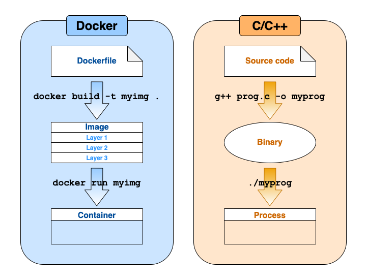

<!-- please stick to one sentence per line! -->
<!-- Citations: @Figueredo:2009dg, citep: [@Figueredo:2009dg], multiple citep: [@Figueredo:2009dg; @other_2018] -->
<!-- add " {-}" after headings to remove numbering -->

# Introduction {#introduction .unnumbered}

Computing infrastructure has advanced to the point where not only can we share data underlying research articles, but we can also share the code that processes these data.
This sharing of code files is enabled by collaboration platforms such as [GitHub](https://github.com) or [GitLab](https://gitlab.com) and has become quite common.
The sharing of the computing environment, on the other hand, is enabled by containerisation, which allows for documenting and sharing entire workflows in a comprehensive way.
Importantly, this sharing of computational assets is paramount for increasing the reproducibility of computational research.
While "papers" based on the traditional journal article format can share extensive details about the research, computational research is often far too complicated to be effectively disseminated in this format [@marwick_how_2015]. 
In this field and whenever software is used to analyse or visualise data, containerisation is needed because a papers's actual contribution to knowledge includes the full computing environment that produced a result [@donoho_invitation_2010].

Containerisation helps provide instructions for packaging the building blocks of computer-based research (i.e., code, data, documentation, and the computing environment).
Specifically, containers are built from plain text files that represent a human- _and_ machine-readable recipe for creating the computing environment and interacting with data.
By providing this recipe, authors of scientific articles greatly improve their work's level of documentation, transparency, and reusability, which is an important part of common practices for scientific computing [@wilson_best_2014; @wilson_good_2017]; an overall goal of these practices is to ensure that both the author and others are able to reproduce and extend an analysis workflow.
The containers built from these recipes are portable encapsulated snapshots of a specific computing environment, which are both more lightweight and transparent than virtual machines.
Such containers have been demonstrated for capturing scientific notebooks [@rule_ten_2019] and reproducible workflows [@sandve_ten_2013].

While several tutorials exist on how to use containers for reproducible research [@nust_author_2017; @chapman_reproducible_2018; @ropensci_labs_r_2015; @udemy_docker_2019; @psomopoulos_lesson_2017] and Guening et&nbsp;al. [@gruening_recommendations_2019] give very helpful recommendations for packaging reusable software in a container, there is no detailed _manual for how to write the actual instructions to create the containers for computational research_ besides generic best practices [@docker_inc_best_2020; @vass_intro_2019].
Here we introduce these instructions for the popular `Dockerfile` format in the context of data science workflows.

# Prerequisites & scope

To start with, we assume you have a scripted scientific workflow, i.e. you can, at least at a certain point in time, execute the full process with a fixed set of commands, for example `make prepare_data` followed by `Rscript analysis.R`, or only `python3 my-workflow.py`.
Since containers that you eventually share with others can only run open source software, tools like Mathematica and Matlab are out of scope for this example.
A workflow that does not support scripted execution is also out of scope for reproducible research, as it does not fit well with containerization.
Furthermore, workflows interacting with many petabytes of data and executed in high-performance computing (HPC) infrastructures are out of scope.
Using such HPC job managers or cloud infrastructures would require a collection of "Ten Simple Rules" articles in their own right. 
For the HPC use case, we encourage the reader to look at Singularity [@kurtzer_singularity_2017].
For this article, we focus on workflows that typically run on single machine, e.g., a researchers laptop computer or a virtual server.
The reader might scope the data requirement to less than a terabyte, and compute requirement to a machine with 16 cores running over the weekend.

Although it is outside the scope of this article, we point readers to `docker-compose` [@docker-compose_2019] in the case where one might need container orchestration for multiple applications, e.g., web servers, databases, and worker containers. 
A `docker-compose.yml` configuration file allows for defining mounts, environment variables, and exposed ports and helps users stick to _one purpose per container_, which often means one process running in the container, and to combine existing stable building blocks instead of bespoke massive containers for specific purposes.

Because _"the number of unique research environments approximates the number of researchers"_ [@nust_opening_2017], sticking to conventions helps every researcher to understand, modify, and eventually write container recipes suitable for their needs.
Even if they are not sure how the underlying technology actually works, researchers should leverage containerisation following good practices.
The practices that are to be discussed in this article are strongly related to software engineering in general and research software engineering in particular, which is concerned with quality, training, and recognition of software in science [@cohen_four_2020].
We encourage you to reach out to your local or national community of research software engineers (see [list of organisations](https://en.wikipedia.org/wiki/Research_software_engineering)) if you have questions on software development in research that go beyond the rules of this work.

While many different container technologies exist, this article focuses on Docker [@wikipedia_contributors_docker_2019].
Docker is a highly suitable tool for reproducible research (e.g., @boettiger_introduction_2017), and our observations indicate it is the most widely used container technology in academic data science.
The goal of this article is to guide you as you write a `Dockerfile`, which is a file format for creating container images.
The rules will help you ensure that the `Dockerfile` allows for interactive development as well as for reaching the higher goals of reproducibility and preservation of knowledge.
Such practices are generally not part of generic containerisation tutorials and are rarely found in `Dockerfile`s published as part of software projects, which are often used as templates by novices.
The differences between a helpful, stable `Dockerfile` and one that is misleading, prone to failure, and full of potential obstacles are not obvious, especially for researchers who do not have extensive software development experience or formal training.
Yet, by committing to this article's rules, one can ensure that their workflows are reproducible and reusable, that computing environments are understandable by others, and that researchers have the opportunity to collaborate effectively.
Applying these rules should not be triggered by the publication of a finished project but should instead be weaved into day-to-day habits (cf.&nbsp;thoughts on openness as an afterthought by @chen_open_2019 and on computational reproducibility by @donoho_invitation_2010).

# Docker & Dockerfiles

Docker [@wikipedia_contributors_docker_2019] is a container technology that has been widely adopted and is supported on many platforms, and it has become highly useful for research.
Containers are distinct from virtual machines or hypervisors, as they do not emulate hardware or operating system kernels and, thus, do not require the same system resources.
Several solutions for facilitating reproducible research are built on top of containers [@brinckman_computing_2018; @code_ocean_2019; @simko_reana_2019; @jupyter_binder_2018; @nust_opening_2017], but these solutions intentionally hide most of the complexity from the researcher.

To create Docker containers for specific workflows, we write text files that follow a particular format called `Dockerfile` [@docker_inc_dockerfile_2019], whereby a `Dockerfile` is a machine- _and_ human-readable recipe for building images, comparable to a `Makefile` [@wikipedia_contributors_make_2019].
Here, container images include the application, e.g., the programming language interpreter needed to run a workflow, and the system libraries required by an application to run.
Thus, a `Dockerfile` consists of a sequence of instructions to copy files and install software.
Each instruction adds a layer to the image, which can be cached across image builds for minimizing build and download times.
The images have a main executable exposed as an "entrypoint" that is started when they are run as stateful containers, which are the running instances of Docker images.
Further, containers can be modified, stopped, restarted and purged.

A visual analogy for building and running a container is provided in Figure&nbsp;1.
Akin to compiling source code for a programming language, creating a container also starts with a plain text file (Dockerfile), which provides instructions for building an image.
Similar to using a compiled binary file to launch a program, the image is then run to create a container instance.
See Listing&nbsp;1 for a full `Dockerfile`, which we will refer to throughout this article.

```{r container-analogy, echo=FALSE, fig.cap="The workflow to create Docker containers by analogy. Containers begin with a Dockerfile, a recipe for building the computational environment (analogous to source code in a compiled programming language). This is used to build an image with the \\texttt{docker build} command, analogous to compiling the source code into an executable (binary) file. Finally, the image is used to launch one or more containers with the \\texttt{docker run} command (analogous to running an instance of the compiled binary as a process).", out.width = '100%', fig.pos="h"}

```

While Docker was the original technology to support the `Dockerfile` format, other container technologies with support include [podman](https://podman.io/)/[buildah](https://github.com/containers/buildah) supported by RedHat, [kaniko](https://github.com/GoogleContainerTools/kaniko), [img](https://github.com/genuinetools/img), and [buildkit](https://github.com/moby/buildkit).
The container software Singularity [@kurtzer_singularity_2017], which is optimised for scientific computing and the security needs of HPC environments, does use its own format, called the _Singularity recipe_, but it can also import and run Docker images.
The rules here are transferable to Singularity recipes to some extent.

While some may argue against publishing reproducibly, e.g., due to a lack of time and incentives, a reluctance to share (cf.&nbsp;@boettiger_introduction_2015), and the substantial technical challenges involved in maintaining software and documentation, it should become increasingly easier for the average researcher to provide with their publication a `Dockerfile`, a pre-built Docker image, or another type of container.
If a researcher can find and create containers or write a `Dockerfile` to address their most common use cases, then, arguably, providing it would not make for extra work after this initial setup (cf.&nbsp;README of @marwick_madjebebe_2015).
In fact, the `Dockerfile` itself represents powerful documentation to show from where data and code were derived, i.e., downloaded or installed, and, consequently, where a third party might obtain the data again.

\clearpage

\scriptsize

```dockerfile
FROM rocker/verse:3.6.2

### INSTALL BASE SOFTWARE #####################################################
# install Java, needed for package rJava
RUN apt-get update && \
  apt-get install -y default-jdk && \
  rm -rf /var/lib/apt/lists/*

# install system dependencies for R packages
RUN apt-get update && \
  apt-get install
    # needed for RNetCDF:
    netcdf udunits-2 \
    # needed for ...:
    more \
    arguments

# Taken from https://github.com/rocker-org/geospatial/blob/master/Dockerfile
RUN install2.r --error \
    RColorBrewer \
    RandomFields \
    RNetCDF

WORKDIR /tmp

### INSTALL WORKFLOW TOOLS ####################################################
# Install latest version of crucial tool with bugfix from source
RUN apt-get update && \
  apt-get install -y \
    build-essential && \
  wget https://download.url/crucialware/version-1.2.3.zip && \
  unzip *.zip -d crucialware && \
  cd crucialware && \
  ./configure && make && make install && \
  rm -rf /tmp/crucialware version-*.zip && \
  rm -rf /var/lib/apt/lists/*

# Install Python tools
COPY requirements.txt requirements.txt
RUN pip install -r requirements.txt

### ADD MY OWN SCRIPTS ########################################################
# Add workflow scripts
WORKDIR /work
COPY myscript.sh myscript.sh
COPY plots.R plots.R

# Uncomment the following lines to execute preprocessing tasks during build
#RUN snakemake --use-conda <other params>
#RUN nextflow workflow.nf --in 'dataset/*.fa'
#RUN java -jar cromwell-XY.jar run myWorkflow.wdl
#RUN Rscript prepare-plots.R

### WORKFLOW CONTAINER FEATURE ################################################
# CMD from base image used for development, uncomment the following lines to 
# have a "run workflow only" container
# CMD["./myscript.sh"]

### Usage instructions ########################################################
# Build the images with
# > docker build --tag great_workflow:1.0.0 .
# Run the image:
# > docker run --it --port 80:8787 --volume ./input:/input \
#     --name gwf great_workflow
# Extract the data:
# > docker cp gwf:/output/ ./outputData
# Extract the figures:
# > docker cp gwf:/work/figures/ ./figures
```

\normalsize

_Listing&nbsp;1_: `Dockerfile` full example.

\newpage

# 1. Use available tools {-}
\rulelabel{1}{rule:tools}

Rule 1 could informally be described as "Don't bother to write a Dockerfile!".
Writing a `Dockerfile` from scratch can be difficult, and even experts sometimes take shortcuts.
Thus, a good strategy is to first look at tools that can help generate a `Dockerfile` for you.
Such tools have likely thought about and implemented good practices, and they may even have incorporated newer practices when reapplied at a later point in time.
Therefore, the most important rule is to apply a multi-step process for your specific use case.

First, you want to determine whether there is an existing container that you can use; if so, you want to be able to use it and add the instructions for doing so to your workflow documentation.
As an example, you might be doing some kind of interactive development.
For interactive development environments such as notebooks and development servers or databases, you can readily find containers that come installed with all the software that you need.
You can look for information about images in (a) the documentation of the used software, (b) the Docker image registry _Docker Hub_, [https://hub.docker.com/](https://hub.docker.com/), or (c) the source code projects of the used software, as many developers today rely on containers for development, testing, and teaching.

Second, if there is no suitable pre-existing container for your needs, you might next look to well-maintained tools to help with `Dockerfile` generation.
These tools can add required software packages to an existing image without you having to manually write a `Dockerfile` at all.
"Well-maintained" not only refers to the tool's own stability and usability but also indicates that suitable base images are used, likely from the official Docker library [@docker_inc_official_2019], to ensure that the container has the most recent security fixes for the operating system in question.
See the next section "Tools for container generation" for details.

Third, if these tools do not meet your needs, you may want to write you own `Dockerfile`.
_In this case, follow the remaining rules._

------

## Tools for container generation

`repo2docker` [@jupyter_binder_2018] is a tool maintained by [Project Jupyter](https://jupyter.org/) that can help to transform a source code or data repository, e.g., GitHub, GitLab, or Zenodo, into a container.
The tool relies on common configuration files for defining software dependencies and versions, and it supports a few more special files; see the [supported configuration files](https://repo2docker.readthedocs.io/en/latest/config_files.html).
As an example, we might install `jupyter-repo2docker` and then run it against a repository with a `requirements.txt` file, an indication of being a Python workflow with dependencies on the [Python Package Index](https://pypi.org/) (PyPI), using the following command:
  
\footnotesize

```bash
jupyter-repo2docker https://github.com/norvig/pytudes
```

\normalsize

The resulting container image installs the dependencies listed in the requirements file, and it provides an entrypoint to run a notebook server to interact with any existing workflows in the repository.
Since `repo2docker` is used within [MyBinder.org](https://mybinder.org/), if you make sure your workflow is "Binder-ready", you and others can also obtain an online workspace with a single click.
However, one precaution to consider is that the default command above will create a home for the current user, meaning that the container itself would not be ideal to share; instead, any researcher interested in interacting with the code inside should run `repo2docker` themselves and create their own container.
Because `repo2docker` is deterministic, the environments are the same (see&nbsp;\ruleref{rule:pinning} for ensuring the same software versions).

Additional tools to assist with writing `Dockerfile`s include `containerit` [@nust_containerit_2019] and `dockta` [@stencila_dockta_2019].
`containerit` automates the generation of a standalone `Dockerfile` for workflows in R.
It can provide a starting point for users unfamiliar with writing a `Dockerfile`, or it can, together with other R packages, provide a full image creation and execution process without having to leave an R session.
`dockta` supports multiple programming languages and configurations files, just as `repo2docker` does, but it attempts to create a readable `Dockerfile` compatible with plain Docker and to improve user experience by cleverly adjusting instructions to reduce build time.
While perhaps more useful for fine-tuning, linters can also be helpful when writing Dockerfiles, by catching errors or non-recommended formulations (see \ruleref{rule:usage}). 

## Tools for templating

It is likely going to be the case that over time you will work on projects and develop images that are similar in nature to each other.
To avoid constantly repeating yourself, you should consider adopting a standard workflow that will give you a clean slate for a new project.
As an example, cookie cutter templates [@cookiecutter_contributors_cookiecutter_2019] or community templates (e.g., [@marwick_rrtools_2019]) can provide the required structure and files, (e.g., for documentation, CI, and licenses), for getting started.
If you decide to build your own cookie cutter template, consider collaborating with your community during development of the standard to ensure it will be useful to others.

Part of your project template should be a protocol for publishing the `Dockerfile` and even exporting the image to a suitable location, e.g., a container registry or data repository, taking into consideration how your workflow can receive a DOI for citation.
A template is preferable to your own set of base images because of the maintenance efforts the base images require.
Therefore, instead of building your own independent solution, consider contributing to existing suites of images (see \ruleref{rule:base}) and improving these for your needs.

For any tool that you use, be sure to look at documentation for usage and configuration options, and look for options to add metadata (e.g., labels see&nbsp;\ruleref{rule:document}).

------

# 2. Use versioned images {-}
\rulelabel{2}{rule:base}

A good understanding of how _base images_ and _image tags_ work is crucial, as the image and tag that you choose has important implications for your container.
It is good practice to use **base images** that are maintained by the Docker library, so called _"official images"_ [@docker_inc_official_2020], which benefit from a review for best practices and vulnerability scanning [@docker_inc_best_2020].
You can identify these images by the missing user portion of the image name, which comes before the `/`, e.g., `r-base` or `python`.
However, these images only provide basic programming languages or very widely used software, so you will likely use images maintained by organisations or fellow researchers.
While some organisations can be trusted to update containers with security fixes (see list below), for most individual accounts that provide ready-to-use images, it is likely that these will not be updated regularly.
Further, it's even possible that an image or a `Dockerfile` could disappear, or an image could be published with malicious intent (though we have not heard of any such case in academia).
Therefore, for security, transparency, and reproducibility, you should only use images where you have access to the `Dockerfile`.
In case a repository goes away, we suggest that you save a copy of the `Dockerfile` within your project (see \ruleref{rule:mount}).

Images have **tags** associated with them, and these tags have specific meanings, e.g., a version indicator such as `3.7` or `dev`, or variants like `slim` that attempt to reduce image size.
Tags are defined at the time of image build and appear in the image name after the `:` when you use an image, e.g., `python:3.7`.
By _convention_ a missing tag is assumed to be the word `latest`, which gives you the latest updates but is also a moving target for your computing environment that can break your workflow.
Note that a version tag means that the tagged software is frozen, but it does not mean that the image will not change, as backwards compatible fixes (cf.&nbsp;semantic versioning, [@preston-werner_semantic_2013]), e.g., version `1.2.3` that fixes a security problem in version `1.2.2` or updates to an underlying system library, would be published to the parent tag `1.2`.

For data science workflows, you should always rely on version-specific image tags both for base images that you use and for images that you build yourself and then run (see usage instructions in Listing&nbsp;1 for an example of the `--tag` parameter of `docker build`).
When keeping different versions (tags) available, it is good practice to publish an image in an image registry.
For details, we refer you to the documentation on automated builds, see [Docker Hub Builds](https://docs.docker.com/docker-hub/builds/) or [GitLab's Container Registry](https://docs.gitlab.com/ee/user/packages/container_registry/index.html#build-and-push-images) as well as continuous integration (CI) services such as [GitHub actions](https://github.com/actions/starter-workflows/tree/master/ci), or [CircleCI](https://circleci.com/orbs/registry/orb/circleci/docker#commands-build) that can help you get started.
Do not `docker push` a locally built image, because that counteracts the considerations outlined above.
If a pre-built image is provided in a public image registry, do not forget to direct the user to it in your documentation, e.g., in the `README` file or in an article.

The following list is a selection of communities that produce widely used, regularly updated images, including ready-to-use images with preinstalled collections of software configured to work out of the box.
Do take advantage of images, especially for complex software environments, e.g., machine learning tool stacks, or a specific [BLAS](https://en.wikipedia.org/wiki/Basic_Linear_Algebra_Subprograms) library.

- [Rocker](https://www.rocker-project.org/) for R and RStudio images [@boettiger_introduction_2017]
- [Bioconductor Docker images](https://bioconductor.org/help/docker/) for bioinformatics with R
- [NeuroDebian images](https://hub.docker.com/_/neurodebian) for neuroscience [@halchenko_open_2012]
- [Jupyter Docker Stacks](https://jupyter-docker-stacks.readthedocs.io/en/latest/index.html) for Notebook-based computing
- [Taverna Server](https://hub.docker.com/r/taverna/taverna-server) for running Taverna workflows

For example, here is how we would use a base image `verse`, which provides the popular Tidyverse suite of packages [@Wickham2019], with R version `3.5.2` from the `rocker` organisation on Docker Hub (`docker.io`, which is the default and can be omitted).

\footnotesize

```dockerfile
FROM docker.io/rocker/r-ver:3.5.2
```

\normalsize

# 3. Format for clarity
\rulelabel{3}{rule:formatting}
\rulelabel{3}{rule:clarity}

First, it is good practice to think of the `Dockerfile` as a human- _and_ machine-readable file.
This means that you should use indentation, new lines, and comments to make your `Dockerfile` well documented and readable.
Specifically, carefully indent commands and their arguments to make clear what belongs together, especially when connecting multiple commands in a `RUN` instruction with `&&`.
Use `\` at the end of a line to break a single command into multiple lines.
This will ensure that no single line gets too long to comfortably read.
Further, use long versions of parameters for readability (e.g., `--input` instead of `-i`).
When you need to change a directory, use `WORKDIR`, because it not only creates the directory if it does not exist but also persists the change across multiple `RUN` instructions.

Second, clarity is nearly always more important than brevity.
For example, if your container uses a script to run a complex install routine, instead of removing it from the container upon completion, which is commonly seen in production `Dockerfile`s aiming at small image sizes (cf.&nbsp;@gruening_recommendations_2019), you should keep the script in the container for a future user to inspect; the script size is negligible compared to the image size.
However, a common pattern you will encounter is a single and very lengthy `RUN` instruction chaining multiple commands, which installs software and cleans up afterwards.
For example (a) the instruction updates the database of available packages, installs a piece of software from a package repository, and purges the cache of the package manager, or (b) the instruction downloads a software's source archive, unpacks it, builds and installs the software, and then removes the downloaded archive and all temporary files.
Although this pattern creates instructions that are harder to read, it is very common and can even increase clarity within the image file system because installation and build artifacts are gone.
In general, if your container is mostly software dependencies, you should not need to worry about image size because (a) your data is likely to have much larger storage requirements, and (b) transparency and inspectability outweigh storage concerns in data science.
If you really need to reduce the size, you may look into using multiple containers (cf.&nbsp;@gruening_recommendations_2019) or multi-stage builds [@docker_multi-stage_2020].

Depending on the programming language used, your project may already contain files to manage dependencies, and you may use a package manager to control this aspect of the computing environment.
This is a very good practice and helpful, though you should consider the externalisation of content to outside of the `Dockerfile` (see \ruleref{rule:mount}).
Often, a single long `Dockerfile` with sections and helpful comments can be more understandable than a collection of separate files.

Generally, aim to design the `RUN` instructions so that each performs one scoped action, e.g., download, compile, and install _one tool_.
This makes the lines of your `Dockerfile` a well-documented recipe for the user as well as a machine.
Each instruction will result in a new layer, and reasonably grouped changes increase readability of the `Dockerfile` and facilitate inspection of the image, e.g., with tools like dive [@goodman_dive_2019].
Convoluted `RUN` instructions can be acceptable to reduce the number of layers, but careful layout and consistent formatting should be applied.

Although you will find `Dockerfile`s that use [_build-time variables_](https://docs.docker.com/engine/reference/commandline/build/#set-build-time-variables---build-arg) to dynamically change parameters at build time, such a customisation option reduces clarity for data science workflows.

# 4. Document within the Dockerfile
\rulelabel{3}{rule:document}

## Explain in comments

As you are writing the `Dockerfile`, be mindful of how other people (including future you!) will read it and why.
Are your choices and commands being executed clearly, or are further comments warranted?
To assist others in making sense of your `Dockerfile`, you can add comments that include links to online forums, code repository issues, or version control commit messages to give context for your specific decisions.
For example [this `Dockerfile` by Kaggle](https://github.com/Kaggle/docker-rstats/blob/master/Dockerfile) does a good job of explaining the reasoning behind the contained instructions.
If you copy instructions from another `Dockerfile`, acknowledge the source in a comment.
Also, it can be helpful to include comments about commands that did not work so you do not repeat past mistakes.
Further, if you find that you need to remember an undocumented step, that is an indication this step should be documented in the `Dockerfile`.
All instructions can be grouped starting with a short comment, which also makes it easier to spot changes if your `Dockerfile` is managed in some version control system (see \ruleref{rule:publish}).
Listing&nbsp;2 shows a selection of typical kinds of comments that are useful to include in a `Dockerfile`.

\scriptsize

```dockerfile
...

# apt-get install specific version, use 'apt-cache madison <pkg>' 
# to see available versions
RUN apt-get install python3-pandas=0.23.3+dfsg-4ubuntu1

# RUN command spreading several lines
RUN R -e 'getOption("repos")' && \
  install2.r \
    fortunes \
    here

# this library must be installed from source to get version newer
# than in sources
RUN git clone http://url.of/repo && \
  cd repo && \
  make build && \
  make install

# following commands from instructions at https://gitlab.com/helpful/repo
```

\normalsize

_Listing&nbsp;2_: Partial `Dockerfile` with examples for helpful comments.

## Add metadata as labels

Docker automatically captures useful information in the image metadata, such as the version of Docker used for building the image.
The [`LABEL` instruction](https://docs.docker.com/engine/reference/builder/#label) can add _custom metadata_ to images.
You can view all labels and other image metadata with [`docker inspect`](https://docs.docker.com/engine/reference/commandline/inspect/) command.
Listing&nbsp;3 shows the most relevant ones for data science workflows.
Labels serve as structured metadata that can be leveraged by services, e.g., https://microbadger.com/labels.
For example, software versions of containerised applications (cf.&nbsp;@gruening_recommendations_2019), licenses, and maintainer contact information are commonly seen, and they are very useful if a `Dockerfile` is discovered out of context.
Regarding licensing information, this should include the license of your own code and could point to a `LICENSE` file within the image (cf.&nbsp;@gruening_recommendations_2019).
While you can add arbitrarily complex information with labels, for data science scenarios the user-facing documentation is much more important.
Relevant metadata that might be more utilised with future tools include global identifiers such as [ORCID identifiers](https://orcid.org/), DOIs of the research compendium (cf.&nbsp;[https://research-compendium.science](https://research-compendium.science)), e.g., [reserved on Zenodo](https://help.zenodo.org/), or a funding agency's grant number.
You can use the [`ARG` instruction](https://docs.docker.com/engine/reference/builder/#arg) to pass variables at build time, for example to pass values into labels, such as the current date or version control revision.
However, a script or `Makefile` might be required to not forget that you set the argument (see \ruleref{rule:usage}).

The OCI Image Format Specification provides some common label keys (see the "Annotations" section in @opencontainers_image-spec_2017) to help standardise field names across container tools, as shown below.
Some keys hold specific content, e.g., `org.opencontainers.image.documentation` is a URL as character string pointing to documentation on the image, and `org.opencontainers.image.licenses` is the [SPDX license identifier](https://spdx.org/licenses/).
You may also commonly find labels in the deprecated [`org.label-schema`-specification](http://label-schema.org/rc1/) format, e.g., `org.label-schema.description`.
However, we encourage the use of the OCI schema in all new and unlabelled projects.

\scriptsize

```dockerfile
...

LABEL maintainer='D. Nüst <daniel.nuest@uni-muenster.de>' \
  org.opencontainers.image.authors='Nüst (daniel.nuest@uni-muenster.de), Sochat, \
    Marwick, Eglen, Head, Hirst, and Evans' \
  org.opencontainers.image.url='https://github.com/nuest/ten-simple-rules' \
  org.opencontainers.image.documentation='https://nuest.github.io/ten-simple-rules-\
    dockerfiles/ten-simple-rules-dockerfiles.pdf' \
  org.opencontainers.image.version='1.0.0'

LABEL org.opencontainers.image.vendor='Ten Simple Institute, Uni of Rules' \
  org.opencontainers.image.description='Reproducible workflow image' \
  org.opencontainers.image.licenses='Apache-2.0'

LABEL edu.science.data.group.project='Find out something (Grant #123456)' \
  edu.science.data.group.name='Data Science Lab' \
  author.orcid='0000-0002-1825-0097'
```

\normalsize

_Listing&nbsp;3_: Partial `Dockerfile` with commonly used labels.

## Define versions, parameters, and paths once

The [`ENV` instruction](https://docs.docker.com/engine/reference/builder/#env) in a `Dockerfile` allows for defining environment variables.
These variables persist inside the container and can be useful, for example, for (a) setting software versions or paths and reusing them across multiple instructions to avoid mistakes, (b) specifying metadata intended to be discovered by installed libraries or software, or (c) adding binaries to the path (`PATH`) or library path (`LD_LIBRARY_PATH`).
You should be careful to distinguish these environment variables from those that might vary and be required at runtime.
Listing&nbsp;4 shows some examples.
For runtime environment variables, either to set a new variable or override one set in the container, you can use the `--env` parameter of `docker run` (see Listings&nbsp;4 and&nbsp;6).

\scriptsize

```dockerfile
...

# Define number of cores used by PowerfulAlgorithm to something that is widely available
ENV POWER_ALG_CORES 2

# Install UsefulSoft tool in specific version from source
ENV USEFULSOFT_VERSION=1.0.0 \
  USEFULSOFT_INSTALLDIR=/workspace/bin

RUN wget http://usesoft.url/useful_software/$USEFULSOFT_VERSION/useful-$USEFULSOFT_VERSION.zip && \
  unzip useful-$USEFULSOFT_VERSION.zip -d useful-src && \
  cd useful-src && \
  bash install.sh --target $USEFULSOFT_INSTALLDIR && \
  cd .. && \
  rm -r useful-src useful-$USEFULSOFT_VERSION.zip

# Puth UsefulSoft tool on the path for subsequent instructions
ENV PATH $PATH:$USEFULSOFT_INSTALLDIR

### Usage instructions ###
# [...]
# Run the image (defining the number of cores used):
# > docker run --it --env POWER_ALG_CORES 32 my_workflow
```

\normalsize

_Listing&nbsp;4_: Partial `Dockerfile` showing usage of environment variables with the `ENV` instruction.

## Include usage instructions

It is often helpful to provide usage instructions, i.e., how to `docker build` and `docker run` the image, _within_ the `Dockerfile`, either at the top or bottom where the reader is likely to find them.
Such documentation is especially relevant if bind mounts, specific names, or ports are important for using the container; see, for example, the final lines of Listing&nbsp;1.
These instructions are not limited to `docker <command>` but include the usage of bespoke scripts, a `Makefile`, or `docker-compose` (see \ruleref{rule:interactive} and \ruleref{rule:usage}).
Following a common coding aphorism, we might say _"A Dockerfile written three months ago may just as well have been written by someone else"_.
Thus, usage instructions help others, because they quickly get them running your workflow and interacting with the container in the intended way without reading all of the instructions (a ["tl;dr"](https://en.wikipedia.org/wiki/Wikipedia:Too_long;_didn%27t_read)-kind of usage).
The `Dockerfile` alongside your documentation strategy is a demonstration of your careful work habits and good intentions for transparency and computational reproducibility.

# 5. Specify software versions {-}
\rulelabel{6}{rule:pinning}

The reproducibility of your `Dockerfile` heavily depends on how well you define the versions of software to be installed in the image.
The more specifically you can define them the better, because using the desired version leads to reproducible builds.
The practice of specifying versions of software is called _version pinning_ (e.g., on `apt`: https://blog.backslasher.net/my-pinning-guidelines.html).
For stable workflows in a scientific context, it is generally advised to freeze the computing environment explicitly and not rely on the "current" or "latest" software, which is a moving target.

## System libraries

System library versions can largely come from the base image tag that you choose to use, e.g., `ubuntu:18.04`, because the operating system's software repositories are very unlikely to introduce breaking changes but will predominantly fix errors with newer versions.
However, you can also install specific versions of system packages with the respective package manager.
For example, you might want to demonstrate a bug, prevent a bug in an updated version, or pin a working version if you suspect an update could lead to a problem.
Generally, system libraries are more stable than software modules supporting analysis scripts, but in some cases they can be highly relevant to your workflow.
_Installing from source_ is a useful way to install very specific versions, but it comes at the cost of longer build time and more complex instructions.
Here are some examples of terminal commands that will list the currently installed versions of software on your system:

- Debian/Ubuntu: `dpkg --list`
- Alpine: `apk -vv info|sort`
- CentOS: `yum list installed` or `rpm -qa`

When you install several system libraries, it is good practice to add comments about why the dependencies are needed (see Listing&nbsp;1).
This way, if a piece of software is removed from the container, it will be easier to remove the system dependencies that are no longer needed, thereby reducing maintenance overhead: You will not unnecessarily fix problems with a library that is no longer needed or include long-running installations.

## Extension packages and programming language modules

If you need to install packages or dependencies for a specific language, package managers are a good option.
Package managers generally provide reliable mirrors or endpoints to download software, many packages are tested before release, and, most importantly, they provide access to specific versions.
Most package managers have a command line interface that can be used from `RUN` commands in your `Dockerfile`, along with various flavours of "freeze" commands that can output a text file listing all software packages and versions (cf.&nbsp;[https://markwoodbridge.com/2017/03/05/jupyter-reproducible-science.html](https://markwoodbridge.com/2017/03/05/jupyter-reproducible-science.html) cited by @rule_ten_2019).
The biggest risk with using package managers with respect to a `Dockerfile` is outsourcing configuration.
As an example, here are configuration files supported by commonly used languages in scientific programming:

- Python: `requirements.txt` (pip tool, @the_python_software_foundation_requirements_2019), `environment.yml` (Conda, @continuum_analytics_managing_2017)
- R: `DESCRIPTION` file format [@r_core_team_description_1999] and `r` ("little R", @eddelbuettel_littler_2019)
- JavaScript: `package.json` of `npm` [@npm_creating_2019]
- Julia: `Project.toml` and `Manifest.toml` [@julia_tomls_2019]

In some cases (e.g., Conda) the package manager is also able to make decisions about what versions to install, which is likely to lead to a non-reproducible build.
For this reason, it is necessary to pin the dependency versions.
In the case of having few packages, it may be simplest to write the install steps and versions directly into the `Dockerfile` (also for clarity, see \ruleref{rule:clarity}):

\footnotesize

```bash
RUN pip install \
  geopy==1.20.0 \
  uszipcode==0.2.2
```

\normalsize

Alternatively, versions may be specified in a separate dependency file (e.g., `requirements.txt` or `environment.yml`) and `COPY`ied to the image for installation:

\footnotesize

```bash
COPY requirements.txt .
RUN pip install -r requirements.txt
```

\normalsize

This modularization may reduce readability, but provides more flexibility in facilitating different ways of building a reproducible environment, provided the dependency file is under version control in the same repository (see \ruleref{rule:publish}).
You can also use package managers to install software from source code `COPY`ied into the image (see&nbsp;\ruleref{rule:mount}).
Finally, you can use many package managers to install software from source obtained from external code management repositories, e.g., installing a tool from a specific version tag or commit hash.
Be aware of the risk that such installations may later fail, especially when the external repositories are out of your control. However, these concerns can be mitigated by running the installation command with the full URL (including the specific version tag or commit hash) which is helpful in troubleshooting if problems arise.
The version pinning capabilities of these file formats and package managers are described in their respective documentation.

As a final note on software installation, you should be aware of the [`USER` instruction](https://docs.docker.com/engine/reference/builder/#user) in a `Dockerfile` and how your base image might change the user for particular instructions, restricting which commands can be run within the container.
It is common to use images with the default user `root`, which is required for installing system dependencies.
However you may encounter base images running as a non-root user (e.g., in the Jupyter and Rocker image stacks), in order to avoid permission problems when mounting files into the container, especially for "output" files (see&nbsp;\ruleref{rule:mount}).
We recommend ensuring that the image works without specifying any users, and, if your image deviates from that, we suggest you document it precisely.

# 6. Use version control {-}
\rulelabel{9}{rule:publish}

As plain text files, `Dockerfile`s are well suited for use with version control systems.
Including a `Dockerfile` alongside your code and data is an effective way to consistently build your software, to show visitors to the repository how it is built and used, to solicit feedback and collaborate with your peers, and to increase the impact and sustainability of your work (cf.&nbsp;@emsley_framework_2018).
Most importantly, you should publish _all_ files `COPY`ied into the image, e.g., test data or files for software installation from source (see&nbsp;\ruleref{rule:mount}), in the same public repository as the `Dockerfile`, e.g., in a research compendium.

Online collaboration platforms (e.g., GitHub, GitLab) also make it easy to use CI services to test building and executing your image in an independent environment.
Continuous integration increases stability and trust, and it allows for images to be published automatically.
Automation strategies exist to build and test images for multiple platforms and software versions, even with CI.
Such approaches are often used when developing popular software packages for a broad user base operating across a wide range of target platforms and environments, and they can be leveraged if you expect your workflow to fall into this category.
Furthermore, the commit messages in your version-controlled repository preserve a record of all changes to the `Dockerfile`, and you can use the same versions in tags for both the container image and the git repository.

Importantly, you should publish _all_ files `COPY`ied into the container, e.g., test data, custom scripts or files for software installation from source (see&nbsp;\ruleref{rule:mount}) in the same public repository as the `Dockerfile`, e.g., in a research compendium.
If you prefer to edit your scripts more interactively in a running container (e.g., using Jupyter) then it may be more convenient to bind mount their directory from the host at run time, provided all changes are commited before sharing. 

# 7. Mount datasets at run time {-}
\rulelabel{7}{rule:mount}

The role of containers is to provide the computing environment, not to encapsulate (potentially very large) datasets.
It is better to insert large data files from the local machine into the container at runtime, and use the image primarily for the software and dependencies.
This insertion is achieved by using [_bind mounts_](https://docs.docker.com/storage/bind-mounts/).
Mounting these files is preferable to using the `ADD`/`COPY` instructions in the `Dockerfile`, because files persist when the container instance or image is removed from your system, and the files are more accessible when the workspace is published.
If you want to add local files to the container, (and do not need [`ADD`'s extra features](https://docs.docker.com/engine/reference/builder/#add)) we recommend `COPY` because it is simpler and explicit.
Volumes are useful for persisting changes across runs of a container and offer faster file I/O compared to other mounting methods (particularly useful with databases for example). 
However they are less suitable for reproducibility, since these changes exist within the image (making them less in line with treating containers as ephemeral see&nbsp;\ruleref{rule:usage}) and are not so easy to access or place under version control. 
Unless specific features are needed, bind mounts are therefore preferable to [storage volumes](https://docs.docker.com/storage/volumes/) since the contents are directly accessible from both the container and the host and the files can be more easily included in the same repository. 

Storing _data files_ outside of the container allows handling of very large or sensitive datasets, e.g., proprietary data or private information.
Do not include such data in an image!
To avoid publishing sensitive data by accident, you can add the data directory to the [`.dockerignore`](https://docs.docker.com/engine/reference/commandline/build/#use-a-dockerignore-file) file, which excludes files and directories from the [build context](https://docs.docker.com/engine/reference/commandline/build/#extended-description), i.e., the set of files considered by `docker build`.
Ignoring data files also speeds up the build in cases where there are very large files or many small files.
As an exception, you should include dummy or small test datasets in the image to ensure that a container is functional without the actual dataset, e.g., for automated tests, instructions in the user manual, or peer review (see also "functional testing logic" in @gruening_recommendations_2019).
For all these cases, you should provide clear instructions in the `README` file on how to use the actual (or dummy) data, and how to obtain and mount it if it is kept outside of the image.
When publishing your workspace, e.g., on Zenodo, having datasets outside of the container also makes them more accessible to others, for example for reuse or analysis.

A mount can also be used to access _output data_ from a container; this can be an extra mount or the same `data` directory.
Alternatively, you can use the [`docker cp`](https://docs.docker.com/engine/reference/commandline/cp/) command to access files from a running or stopped container, but this requires a specific handling, e.g., naming the container when starting it or using multiple shells, which requires very detailed instructions for users.

You can use the `-v`/`--volume` or preferably `--mount` flags to `docker run` to configure bind mounts of directories or files [@docker_use_2019], including options, as shown in the following examples.
If the target path exists within the image, the bind mount will replace it for the started container.
(Note, `$HOME` is an environment variable in UNIX systems representing the path to the current user's home directory, e.g., `/home/moby`, and `$(pwd)` returns the current path.)

\footnotesize

```bash
# mount directory
docker run --mount type=bind,source=$HOME/project,target=/project mycontainer

# mount directory as read-only
docker run --mount type=bind,src=$HOME/project,dst=/workspace,readonly mycontainer

# mount multple directories, one with write access relative to current path (Linux)
docker run --mount type=bind,src=$(pwd)/article-x-supplement/data,dst=/input-data,readonly \
  --mount type=bind,src=$(pwd)/outputs,dst=/output-data mycontainer
```

\normalsize

How your container expects external resources to be mounted into the container should be included in the example commands (see \ruleref{rule:formatting}).
In these commands, you can also make sure to avoid issues with file permissions by using Docker's `--user` option.
For example, by default, writing a new file from inside the container will be owned by user `root` on your host, because that is the default user within the container.

# 8. Make it one-click runnable {-}
\rulelabel{8}{rule:interactive}

Containers are very well suited for day-to-day development tasks (see also \ruleref{rule:usage}), because they support common interactive environments for data science and software development.
But they are also useful for a "headless" execution of full workflows.
For example, @verstegen_pluc_mozambique_2019 demonstrates a container for running an agent-based model with video files as outputs, and this article's [R Markdown](https://rmarkdown.rstudio.com/) source, which included cells with analysis code, is [rendered into a PDF in a container](https://github.com/nuest/ten-simple-rules-dockerfiles/blob/master/.travis.yml#L18).
A workflow that does not support headless execution may even be seen as irreproducible.

These two usages can be configured by the `Dockerfile`'s author and exposed to the user based on the `Dockerfile`'s `ENTRYPOINT` and `CMD` instructions.
An image's main purpose is reflected by the default process and configuration, though the `ENTRYPOINT` and `CMD` can also be changed at runtime.
It is considered good practice to have a combination of default entrypoint and command that meets reasonable user expectations.
For example, a container known to be a workflow should execute the entrypoint to the workflow and perhaps use `--help` as the command to print out usage.
The container entrypoint should _not_ execute the workflow, as the user is likely to run the container for basic inspection, and starting an analysis as a surprise that might write files is undesired.
As the maintainer of the workflow, you should write clear instructions for how to properly interact with the container, both for yourself and others.
A possible weakness with using containers is that they can only provide one default entrypoint and command.
However, tools, e.g., The Scientific Filesystem [@sochat_scientific_2018], have been developed to expose multiple entrypoints, environments, help messages, labels, and even install sequences.
With plain Docker, you can override the defaults as part of the `docker run` command or in an extra `Dockerfile` using the primary image as a base, as shown in Listing&nbsp;5.
In any case, you should document different variants very well and potentially capture build and run commands in a `Makefile` [@wikipedia_contributors_make_2019].
If you use a `Makefile`, then keep it in the same repository (see \ruleref{rule:mount}) and include instructions for its usage (see \ruleref{rule:document}).
To support advanced custom configuration, it is helpful to expose settings via a configuration file, which can be bind mounted from the host [@verstegen_pluc_mozambique_2019], via environment variables (see \ruleref{rule:pinning} and @knoth_reproducibility_2017), or via wrappers using Docker, such as Kliko [@molenaar_klikoscientific_2018].

\scriptsize

```Dockerfile
# base image (interactive)
FROM jupyter/datascience-notebook:python-3.7.6

# Usage instructions:
# docker build --tag workflow:1.0 .
# docker run workflow:1.0
```
```Dockerfile
# interactive image
FROM workflow:1.0

ENTRYPOINT ["python"]
CMD ["/workspace/run-all.sh"]

# Usage instructions:
# docker build --tag workflow-runner:1.0 --file Dockerfile.runner .
# docker run -e ITERATIONS=10 -e ALGORITHM=advanced \
#     --volume /tmp/results:/workspace/output_data workflow-runner:1.0
```

\normalsize

_Listing&nbsp;5_: Workflow `Dockerfile` and derived "runner image" `Dockerfile` with file name `Dockerfile.runner`. \newline

_Interactive graphical interfaces_, such as [RStudio](https://rstudio.com/products/rstudio/), [Jupyter](https://jupyter.org/), or [Visual Studio Code](https://code.visualstudio.com/), can run in a container to be used across operating systems and both locally and remotely via a regular web browser.
The HTML-based user interface is exposed over HTTP.
Use the `EXPOSE` instruction to document the ports of interest for both humans and tools, because they need to be bound to the host to be accessible to the user using the `docker run` option `-p`/`--publish <host port>:<container port>`.
The container should also print to the screen of the used ports along with any login credentials needed.
For example, this is done in the last few lines of the output of running a Jupyter Notebook server locally (lines abbreviated):

\footnotesize

```{bash datascience_notebook, eval=FALSE}
docker run -p 8888:8888 jupyter/datascience-notebook:7a0c7325e470
```
```
[...]
[I 15:44:31.323 NotebookApp] The Jupyter Notebook is running at:
[I 15:44:31.323 NotebookApp] http://9027563c6465:8888/?token=6a92d [..]
[I 15:44:31.323 NotebookApp]  or http://127.0.0.1:8888/?token=6a92 [..]
[I 15:44:31.323 NotebookApp] Use Control-C to stop this server and [..]
```

\normalsize

A person who is unfamiliar with Docker but wants to use your image may rely on graphical tools like [ContainDS](https://containds.com/), [Portainer](https://www.portainer.io/), or the [Docker Desktop Dashboard](https://docs.docker.com/desktop/dashboard/) for assistance in managing containers on their machine without using the Docker CLI.

_Interactive usage of a command-line interface_ is quite straightforward to access from containers, if users are familiar with this style of user interface.
Running the container will provide a shell where a tool can be used and where help or error messages can assist the user.
For example, complex workflows in any programming language can, with suitable pre-configuration, be triggered by running a specific script file.
If your workflow can be executed via a command line client, you may use that to validate correct functionality of an image in automated builds, e.g., by using a small toy example and checking the output, by checking successful responses from HTTP endpoints provided by the container, such as with an HTTP response code of `200`, or by using a controller such as Selenium [@selenium_2019].

The following example runs a simple R command counting the lines in this article's source file.
The file path is passed as an environment variable.

\footnotesize

```{bash env_param_pass, eval=FALSE}
docker run \
  --env CONFIG_PARAM="/data/ten-simple-rules-dockerfiles.Rmd" \
  --volume $(pwd):/data \
  jupyter/datascience-notebook:7a0c7325e470 \
  R --quiet -e "
l = length(readLines(Sys.getenv('CONFIG_PARAM')));
print(paste('Number of lines: ', l))
"
```
```
> l = length(readLines(Sys.getenv('CONFIG_PARAM')));
> print(paste('Number of lines: ', l))
[1] "Number of lines:  568"
```

_Listing&nbsp;6_: Passing a parameter via environment variable.

\normalsize

If there is only a regular desktop application, the host's window manager can be connected to the container.
Although this raises notable security issues, they can be addressed by using the "X11 forwarding" natively supported by Singularity [@singularity_frequently_2019], which can execute Docker containers, or by leveraging supporting tools such as `x11docker` [@viereck_x11docker_2019].
Other alternatives include bridge containers [@yaremenko_docker-x11-bridge_2019] and exposing a regular desktop via the browser (e.g., for Jupyter Hub [@yuvipanda_jupyter-desktop-server_2019]).
This variety of approaches renders seemingly more convenient uncontainerised environments unnecessary.
Just using one's local machine is only slightly more comfortable but much less reproducible and portable.

# 9. Order the instructions
\rulelabel{5}{rule:order}

You will regularly build an image during development of your workflow.
You can take advantage of _build caching_ to avoid execution of time-consuming instructions, e.g., install from a remote resource or copying a file that gets cached.
Therefore, you should keep instructions _in order_ of least likely to change to most likely to change.
Docker will execute the instructions in the order that they appear in the `Dockerfile`; when one instruction is completed, the result is cached, and the build moves to the next one.
If you change something in the Dockerfile and rebuild the container, each instruction is inspected in turn.
If it has not changed, the cached layer is used and the build progresses.
Conversely, if the line has changed, that build step is executed afresh, and then every subsequent instruction will have to be executed in case the changed line influences a later instruction.
You should regularly re-build the image using the `--no-cache` option to learn about broken instructions as soon as possible (cf.&nbsp;\ruleref{rule:usage}).
Such a re-build is also a good occasion to revisit the order of instructions, e.g., if you appended an instruction at the end to save time while iteratively developing the `Dockerfile`, and the formatting.
You can add a version tag to the image before the re-build to make sure to keep a working environment at hand.
A recommended ordering based on these considerations is as follows, and you can use comments to visually separate these sections in your file (cf. Listing&nbsp;1):

1. System libraries
2. Language-specific libraries or modules
  1. from repositories (i.e., binaries)
  2. from source (e.g., GitHub)
3. Installation of your own software and scripts (if not mounted)
4. Copying data and configuration files (if not mounted)
5. Labels
6. Entrypoint and default command

# 10. Regularly use and rebuild containers {-}
\rulelabel{10}{rule:usage}

Using containers for research workflows requires not only technical understanding but also an awareness of risks that can be managed effectively by following a number of good _habits_, discussed in this section.
While there is no firm rule, if you use a container daily, is good practice to rebuild that container every one or two weeks.
At the time of publication of research results, it is good practice to save a copy of the image in a public data repository so that readers of the publication can access the resources that produced the published results. 

First, it is a good habit to use your container every time you work on a project and not just as a final step during publication.
If the container is the only platform you use, you can be highly confident that you have properly documented the computing environment [@marwick_readme_2015].
You should prioritise this usage over others, e.g., non-interactive execution of a full workflow, because it gives you personally the highest value and does not limit your use or others' use of your data and code at all (see \ruleref{rule:interactive}).

Second, for reproducibility, we can treat containers as transient and disposable, and even intentionally rebuild an image at regular intervals.
Ideally, containers that we built years ago should rebuild seamlessly, but this is not necessarily the case, especially with rapidly changing technology relevant to machine learning and data science. 
Habitually deleting a container and performing a cache-less rebuild of the image (a) increases security due to updating underlying software, (b) helps to reveal issues requiring manual intervention, e.g., changes to code or configuration that are not documented in the `Dockerfile` but perhaps should be, and (c) allows you to more incrementally debug issues.
This habit can be supported by using continuous deployment or CI strategies.

In you need a setup or configuration for the first two habits, it is good practice to provide a `Makefile` alongside your container, which can capture the specific commands.
Furthermore, when you rebuild the image, you can take a fresh look at the `Dockerfile` and improve it over time, because it will be hard to apply all rules at once.
A linter can help you with such optimisations, e.g., as a web service such as [Dockerfilelint](https://www.dockerfilelint.com/), [hadolint](https://hadolint.github.io/hadolint/) or [fromlatest](https://www.fromlatest.io/), as an extension to your integrated development environment, such as [vscode-docker](https://github.com/microsoft/vscode-docker), or as standalone tools like [`dockerfile-lint`](https://github.com/projectatomic/dockerfile_lint), which you can integrate with your `Makefile`.

Third, you can export the image to file and deposit it in a public data repository, where it not only becomes citable but also provides a snapshot of the _actual_ environment you used at a specific point in time.
You should include instructions for how to import and run the workflow based on the image archive and add your own image tags using semantic versioning (see \ruleref{rule:base}) for clarity.
Depositing the image next to other project files, i.e., data, code, and the used `Dockerfile`, in a public repository makes them likely to be preserved, but it is highly unlikely that over time you will be able to recreate it precisely from the accompanying `Dockerfile`.
Publishing the image and the contained metadata therein (e.g., the Docker version used) may even allow future science historians to emulate the Docker environment.
Sharing the actual image via a registry and a version-controlled `Dockerfile` together allows you to freely experiment and continue developing your workflow and keep the image up to date, e.g., updating versions of pinned dependencies (see \ruleref{rule:pinning}) and regular image building (see above).

Finally, for a sanity check and to foster even higher trust in the stability and documentation of your project, you can ask a colleague or community member to be your code copilot (see [https://twitter.com/Code_Copilot](https://twitter.com/Code_Copilot)) to interact with your workflow container on a machine of their own.
You can do this shortly before submitting your reproducible workflow for peer-review, so you are well positioned for the future of scholarly communication and open science, where these may be standard practices required for publication [@eglen_codecheck_2019; @chen_open_2019; @schonbrodt_training_2019; @eglen_recent_2018].

# Example Dockerfiles

To demonstrate the ten rules, we maintain a collection of annotated example `Dockerfile`s in a GitHub repository, some of which we took from public repositories and updated to adhere better to the rules: [https://github.com/nuest/ten-simple-rules-dockerfiles/tree/master/examples](https://github.com/nuest/ten-simple-rules-dockerfiles/tree/master/examples)

# Conclusion {#conclusion .unnumbered}

In this article we have provided guidance for using `Dockerfile`s to create containers for use and communication in smaller-scale data science research.
Reproducibility in research is an endeavor of incremental improvement and best efforts, not about achieving the perfect solution; such a solution may be not achievable for many researchers with limited resources, and its definition may change over time.
Even if imperfect, the effort to create and document scientific workflows provides incredibly useful and valuable transparency for a project.
We encourage researchers to follow these steps taken by their peers to use `Dockerfile`s to practice reproducible research, and we encourage them to change the way they communicate towards "preproducibility" [@stark_before_2018], which values openness, transparency and honesty to find fascinating problems and advance science.
So, we ask researchers, with their best efforts and with their current knowledge, to strive to write readable `Dockerfile`s for functional containers that are realistic about what might break and what is unlikely to break.
In a similar vein, we accept that researchers will freely break these rules if another approach makes more sense _for their use case_.
Also, we ask that researchers not overwhelm themselves by trying to follow all the rules right away, but that they set up an iterative process to increase their computing environment's manageability over time.
Most importantly, we ask researchers to share and exchange their `Dockerfile`s freely and to collaborate in their communities to spread the knowledge about containers as a tool for research and scholarly collaboration and communication.

# Acknowledgements {#acknowledgements .unnumbered}

DN is supported by the project Opening Reproducible Research II (\href{https://o2r.info/}{https://o2r.info/}; \href{https://www.uni-muenster.de/forschungaz/project/12343}{https://www.uni-muenster.de/forschungaz/project/12343}) funded by the German Research Foundation (DFG) under project number PE 1632/17-1.
DN and SJE are supported by a Mozilla mini science grant.
The funders had no role in study design, data collection and analysis, decision to publish, or preparation of the manuscript.
We thank Dav Clark who provided feedback on the preprint [@nust_ten_2020] of this paper.

# Author contributions {#contributions .unnumbered}

DN conceived the idea and contributed to conceptualisation, methodology, and writing - original draft, review & editing.
VS contributed to conceptualisation, methodology, and writing - original draft, review & editing.
BM contributed to writing – review & editing.
SJE contributed to conceptualisation and writing – review & editing.
THe contributed to conceptualisation.
THi contributed to writing – review & editing.
BE contributed to visulisation and writing – review & editing.
This articles was written collaboratively on GitHub, where [contributions in form of text or discussions comments](https://github.com/nuest/ten-simple-rules-dockerfiles/graphs/contributors) are documented: [https://github.com/nuest/ten-simple-rules-dockerfiles/](https://github.com/nuest/ten-simple-rules-dockerfiles/).

# References {#references .unnumbered}
